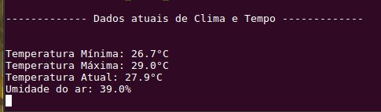

# Trabalho 3 

## Requisitos

1. Conectar-se à internet no modo Station (STA) com as credenciais de Wifi sendo definidas através de variáveis de ambiente do Menuconfig.
2. Enquanto a ESP não se conecta à internet, o LED da placa deverá ficar piscando a cada 1 segundo. Assim que a conexão for estabelecida, o LED deverá permanecer aceso. Caso haja perda de conexão o mesmo deve voltar ao estado piscando.
3. Após confirmar a conexão com a internet, o sistema deverá relizar a cada 5 min uma request aos seguintes serviços:

    - ipstack.com para identificar a localização atual do dispositivo à partir do encereço de IP.
    - openweathermap.org para consultar a previsão do tempo baseado na localização atual.

- Cada vez que a ESP realiza uma request, o LED deve piscar uma vez.
- Imprimir no console a Temperatura atual, máxima e mínima previstas para o dia e a umidade.
Disponibilizar o repositório com o código fonte de modo que o mesmo possa ser compilado à partir de outro computador configurado com a ESP-IDF somente à partir do comando idf.py build.

## Funcionalidades 

- Configuração do Wifi
- Configuração das variáveis de ambiente
- Request HTTP
- Resgate da localização (Usando CJson)
- Resgate de dados de Previsão do Tempo (Usando CJson)
- Impressão dos dados de Tempo (via printf no modo monitor)
- Acionamento do LED

## Como usar 

1. Entrar na pasta do projeto
2. Executar o export.sh do esp-idf 
    - ". ../esp/esp-idf/export.sh" -> Se a pasta esp estiver no mesmo local que o projeto
3. Conectar a ESP32 através do usb
4. Buildar o projeto 
    - idf.py build
5. Transferir o código para a ESP e monitorar 
    - idf.py -p /dev/ttyUSB0 flash monitor

Exemplo de uso: 

